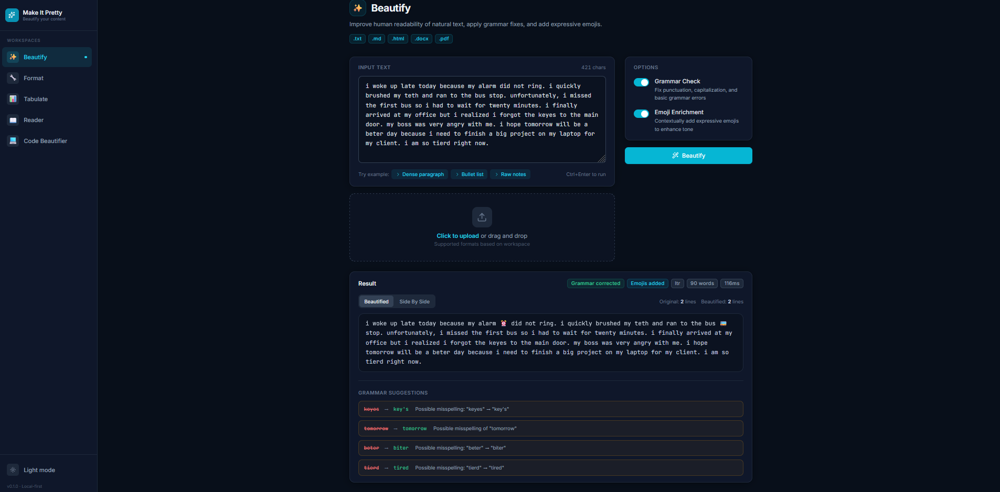
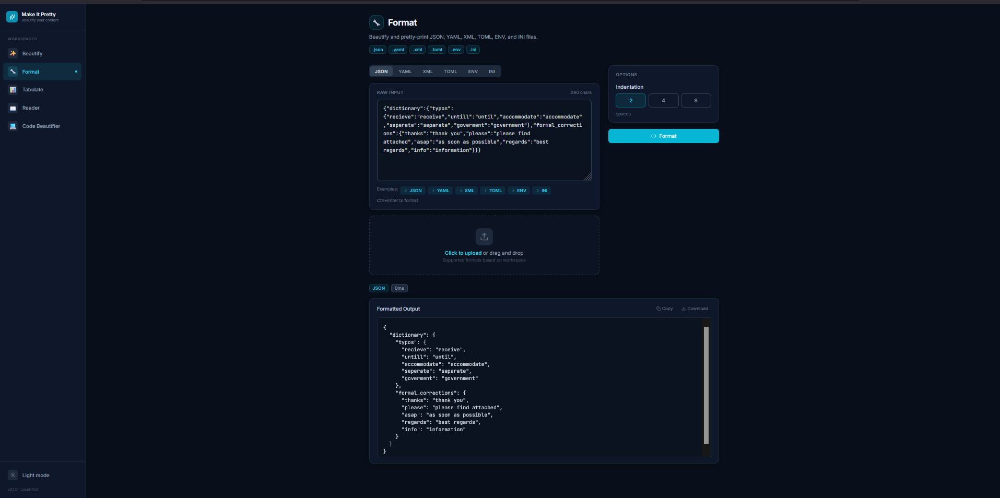
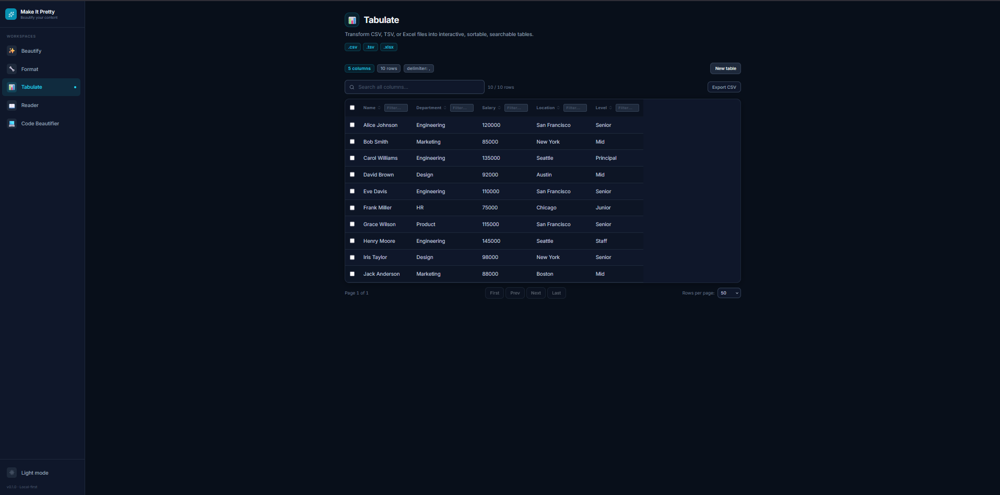
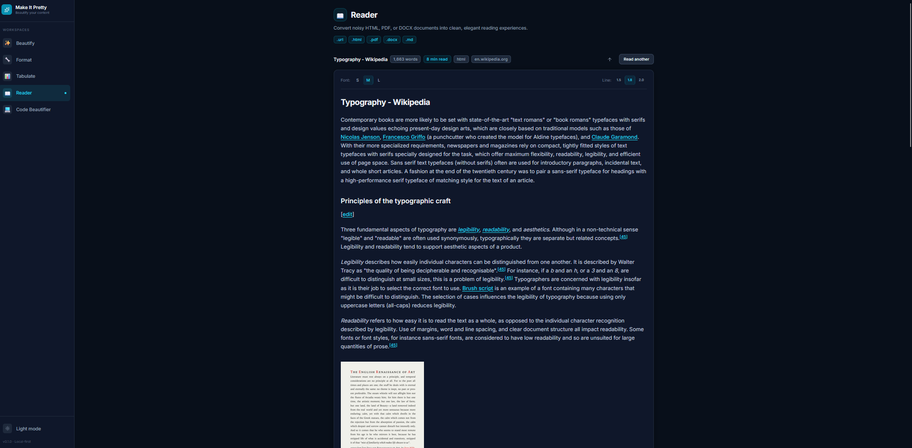
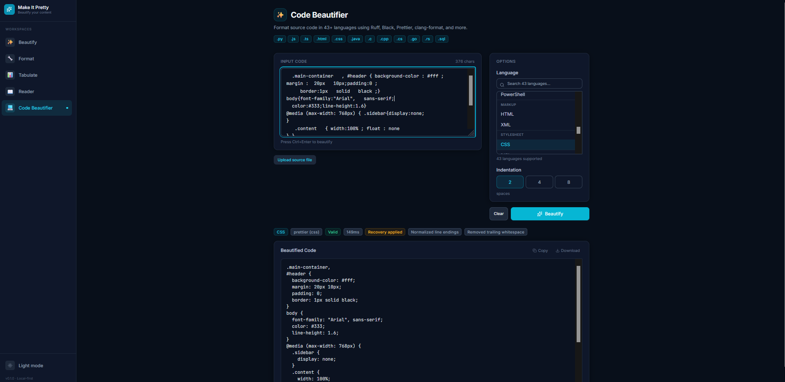

<p align="center">
  
  
  
  
  
  
  
</p>

<h1 align="center">Make It Pretty ✨</h1>

<p align="center">
  <strong>Turn messy content into beautiful, readable output — without AI, without the cloud, without changing your data.</strong>
</p>

<p align="center">
  Beautify text · Format structured data · Render interactive tables · Read documents in peace · Recover source code formatting
</p>

---

## 📖 Table of Contents

- [Why This Project Exists](#why-this-project-exists)
- [Key Features](#key-features)
- [Five Workspaces](#five-workspaces)
- [Supported Formats](#supported-formats)
- [Technology Stack](#technology-stack)
- [Project Architecture](#project-architecture)
- [Screenshots](#screenshots)
- [Repository Structure](#repository-structure)
- [Installation](#installation)
- [Configuration](#configuration)
- [Usage](#usage)
- [Performance](#performance)
- [Contributing](#contributing)
- [FAQ](#faq)
- [Roadmap](#roadmap)
- [License](#license)

---

## 🤔 Why This Project Exists

Every developer deals with **ugly content** — minified JSON that breaks your terminal, code with inconsistent indentation, HTML packed with tracking scripts, CSV files with no formatting, or natural text with erratic spacing.

Existing solutions are fragmented:

- **Prettier** formats code but not data or text
- **Formatters like Black / Ruff** are language-specific
- **Reader modes** exist in browsers but only there
- **Online tools** require uploading your data to someone else's server

**Make It Pretty** fills this gap by providing a single, local-first application that handles the full spectrum: natural text, structured data, tabular data, web content, and source code — all processed locally, all deterministic, all under your control.

> **No AI. No cloud. No tracking. No sign-up. Just beautiful output.**

---

## ✨ Key Features

### 🔒 Local-First by Design

Everything runs on your machine. No data ever leaves your computer. No API keys, no telemetry, no third-party services. Perfect for sensitive documents, proprietary code, or offline environments.

### 🎯 Intent-Based Workspaces

Five specialized workspaces, each designed for a single human intent. No overwhelming feature menus, no confusing configuration — just upload or paste and get results.

### 🔧 Deterministic Processing

Every transformation is rule-based and repeatable. The same input always produces the same output. Zero hallucination risk, predictable behavior, and full control over results.

### 44 Programming Languages

From Python to Solidity, Go to Elixir — the Code Beautifier detects and formats source code using the ecosystem's best formatters (Prettier, Ruff, sqlparse) with intelligent fallback for languages without installed formatters.

### Rich Format Support

JSON, YAML, XML, TOML, CSV, TSV, XLSX, ENV, INI, Markdown, and dozens of source file extensions — all detected automatically by file extension or content analysis.

---

## 🚀 Five Workspaces

### ✨ Beautify — Clean Up Natural Text

**Purpose:** Eliminate formatting inconsistencies in natural language text while preserving meaning.

**Workflow:**
1. Paste or upload text (`.txt`, `.md`, `.html`, `.docx`, `.pdf`)
2. Toggle optional Grammar Suggestions and Emoji Enrichment
3. Click "Beautify" — receive clean, consistent output

**What it fixes:**
- BOM characters and Unicode normalization (NFC)
- Mixed line endings (CRLF → LF)
- Control characters (`\x00`–`\x08`, `\x0b`, `\x0c`, `\x0e`–`\x1f`)
- Trailing whitespace on every line
- Excessive blank lines (max 2 consecutive)
- Collapsed multiple spaces (preserving indentation)

**Optional grammar module** detects double words, space-before-period, ellipsis overuse, and 100+ common misspellings via an integrated dictionary and `pyspellchecker`.

**Optional emoji enrichment** maps 200+ keywords across 25 categories to tasteful emoji — with stemming support and partial-word protection.

**Who benefits:** Writers, editors, translators, anyone cleaning up messy text.

---

### 🔧 Format — Beautify Structured Data

**Purpose:** Take minified, badly-indented, or inconsistent structured data and produce clean, valid output.

**Workflow:**
1. Paste or upload a data file (`.json`, `.yaml`, `.xml`, `.toml`, `.env`, `.ini`)
2. Optionally adjust indent size and sort behavior
3. Click "Format Data" — view beautified output with a detected-format badge

**Supported data formats:**

| Format | Parser | Features |
|--------|--------|----------|
| JSON | `json.loads()` / `json.dumps()` | Pretty-print with configurable indent, optional key sorting, Unicode-safe, tree view toggle |
| YAML | `yaml.safe_load()` / `yaml.dump()` | Block-style output, Unicode support, PyYAML-backed |
| XML | `xml.dom.minidom` | `toprettyxml()` with controlled indentation |
| TOML | `tomllib` (stdlib 3.11+) | Custom serializer preserving table structure |
| ENV | Custom parser | Key/value normalization, comment preservation, stripped quoted values |
| INI | `configparser` | Section headers preserved, standardized KEY=VALUE output |

**JSON tree view** provides a collapsible, syntax-highlighted hierarchical view — ideal for exploring deeply nested JSON.

**Who benefits:** API developers, DevOps engineers, data analysts, configuration maintainers.

---

### 📊 Tabulate — Interactive Table Rendering

**Purpose:** Transform raw tabular data into a fully interactive, sortable, filterable table — without writing a single line of SQL or pandas.

**Workflow:**
1. Upload a `.csv`, `.tsv`, or `.xlsx` file (or paste CSV/TSV text)
2. Optionally select a sheet (for Excel files) or separator
3. View the interactive table with instant sorting, filtering, and pagination

**Interactive features:**
- **Column sorting** — click any header to sort ascending/descending
- **Column filtering** — search within individual columns
- **Global search** — filter across all columns simultaneously
- **Pagination** — 25, 50, 100, 250, or 500 rows per page; handles 100,000+ rows
- **Row selection** — checkbox per row, select-all header checkbox
- **Column resize** — drag column borders to resize
- **Export** — download filtered data as CSV, copy selected rows as JSON or CSV
- **Automatic parsing** — pasted content auto-parses after 400ms with delimiter detection

**Who benefits:** Data analysts, spreadsheet users, anyone who needs to explore tabular data without opening Excel.

---

### 📖 Reader — Clean Document Extraction

**Purpose:** Extract readable content from noisy web pages, PDFs, and Word documents — removing distractions, preserving structure.

**Workflow:**
1. Enter a URL or upload an `.html`, `.pdf`, or `.docx` file
2. Click "Extract" or "Read" — content is cleaned and displayed in a distraction-free reading view
3. Adjust reading experience: dark mode, font size, line height, column width

**URL extraction** uses `readability-lxml` (the same algorithm behind Firefox Reader Mode) with:
- 2 retry attempts with rotating User-Agent headers
- 20-second timeout (10s connect + 15s read)
- Fallback BeautifulSoup extraction when readability returns < 50 characters
- Domain extraction, URL validation, example URL chips in the frontend

**Reading view features:**
- Reading progress bar with estimated time remaining
- Dark mode toggle
- Font size control (S / M / L)
- Line height control (1.5 / 1.8 / 2.0)
- Column width control (narrow / medium / wide)
- Word count and character count
- Estimated reading time

**Who benefits:** Researchers collecting web content, students reading papers, anyone who prefers clean reading without ads and navigation.

---

### 💻 Code Beautifier — Source Code Recovery & Formatting

**Purpose:** Restore and beautify source code using the official formatter of each language, without ever modifying program logic.

**Workflow:**
1. Upload source files (single or batch via drag-and-drop)
2. The engine detects the language, runs a 12-step recovery pipeline, then applies the best available formatter
3. Preview formatted output side-by-side with the original

**Recovery pipeline (12 deterministic steps):**
| Step | Transformation |
|------|---------------|
| 1 | BOM removal |
| 2 | Unicode NFC normalization |
| 3 | CRLF → LF line endings |
| 4 | Control character removal |
| 5 | Mixed tabs/spaces → spaces |
| 6 | Tabs → 4-space indentation |
| 7 | Trailing whitespace removal |
| 8 | Collapsed blank lines (max 2) |
| 9 | Leading blank lines removed |
| 10 | Trailing blank lines removed |
| 11 | Single final newline enforced |
| 12 | Idempotency verification |

**Formatter pipeline** (first available wins):

| Language | Formatter(s) |
|----------|-------------|
| Python | Ruff → Black → autopep8 |
| JavaScript / TypeScript / JSX / TSX | Prettier (babel / typescript) |
| HTML / CSS / SCSS / LESS | Prettier |
| Markdown | Prettier (markdown) |
| SQL | sqlparse (keyword upper-casing) |
| Java | Prettier (plugin) |
| PHP | Prettier (plugin) |
| Solidity | Prettier (plugin) |
| All others (C, Go, Rust, Ruby, etc.) | BuiltinFormatter (brace/keyword indentation) |

**All 44 languages** in the frontend language picker have at least one `is_available()=True` formatter — none fall through to the basic fallback.

**Who benefits:** Developers reformatting legacy code, teams standardizing code style, anyone recovering files from corrupted version control.

---

## 📂 Supported Formats

| Category | Formats |
|----------|---------|
| **Programming Languages** | Python, JavaScript, TypeScript, JSX, TSX, Java, C, C++, C#, Go, Rust, Kotlin, Swift, Dart, Objective-C, Ruby, PHP, Lua, Shell (bash/zsh), Perl, R, Elixir, Erlang, Clojure, Lisp, Solidity, Elm, Scala, Gradle, SASS, Visual Basic, PowerShell |
| **Structured Data** | JSON, YAML, XML, TOML, ENV, INI |
| **Tabular Data** | CSV, TSV, XLSX |
| **Markup & Style** | HTML, CSS, SCSS, LESS |
| **Documentation** | Markdown, RST, Plain Text |
| **Document Formats** | PDF, DOCX |
| **DevOps** | Dockerfile, Makefile, CMake, Shell scripts |
| **Web Content** | URLs (HTML extraction via readability-lxml) |

---

## 🛠️ Technology Stack

### Frontend: React + TypeScript + Vite + Tailwind CSS

| Technology | Why It Was Chosen |
|------------|-------------------|
| **React 19** | Component model maps naturally to the 5-workspace layout. Server components not needed for a local-first tool. |
| **TypeScript 5** | The application manipulates many different data structures (JSON trees, tables, code, documents). Type safety prevents entire categories of bugs. |
| **Vite 5** | Instant HMR during development, fast production builds, native ES module support, and straightforward proxy configuration for API routing. |
| **Tailwind CSS 4** | Utility-first approach keeps component files self-contained. No context-switching between HTML and CSS files. Design system enforced at the class level. |
| **TanStack Table** | Best-in-class headless table library for the Tabulate workspace. Handles sorting, filtering, pagination, and column resizing with zero assumptions about rendering. |
| **Lucide React** | Minimal, consistent icon set. Hand-picked over larger icon libraries. |

### Backend: Python + FastAPI + Pydantic

| Technology | Why It Was Chosen |
|------------|-------------------|
| **Python 3.12** | Rich ecosystem for text processing, data parsing, document extraction, and code formatting. Python is the de facto standard for content processing. |
| **FastAPI** | Async-ready, Pydantic-integrated, auto-documented (OpenAPI at `/docs`). Minimal boilerplate for the 10 REST endpoints. |
| **Pydantic v2** | Request/response validation with zero extra code. Settings management via `pydantic-settings`. |
| **Readability-lxml** | The same algorithm powering Firefox Reader Mode. Battle-tested for web content extraction. |
| **httpx** | Modern async HTTP client for URL fetching. Follows redirects, configurable timeouts, proper connection pooling. |
| **PyYAML + openpyxl + pypdf + python-docx** | Mature, widely-used libraries for format-specific parsing. No reinventing wheels. |

### Architecture Philosophy

- **Frontend is a thin presentation layer** — all processing happens on the backend
- **REST API between them** — keeps the door open for alternative frontends (CLI, API clients)
- **Monorepo** — frontend and backend share a repository but have independent dependency management
- **Service layer isolation** — business logic in `services/` is pure Python functions, completely separable from the HTTP layer

---

## 🏗️ Project Architecture

```
┌─────────────────────────────────────────────────────────┐
│                    Frontend (Vite)                       │
│  React + TypeScript + Tailwind CSS                      │
│                                                         │
│  User uploads/pastes → POST /api/v1/... → Renders UI   │
└──────────────────────┬──────────────────────────────────┘
                       │ HTTP (proxied in dev)
                       ▼
┌─────────────────────────────────────────────────────────┐
│                   Backend (FastAPI)                      │
│  Python + Pydantic                                      │
│                                                         │
│  Route → Service (pure functions) → Response            │
│  Validation at every layer                              │
└─────────────────────────────────────────────────────────┘
```

### High-Level Data Flow

1. User pastes content or uploads a file in the frontend
2. Frontend sends a `POST` request to the appropriate `/api/v1/{workspace}` endpoint
3. Backend route extracts parameters and calls the workspace service
4. Service processes the content deterministically (no AI, no cloud calls)
5. Backend returns the transformed result with metadata
6. Frontend renders the result with the appropriate UI component

---

## 📸 Screenshots

<!--
  Replace these placeholders with actual screenshots from your workspace.

  Suggested screenshots:
  1. Format — JSON data with tree view open
  2. Code Beautifier — Python file side-by-side diff
  3. Tabulate — Large CSV with filters and sorting active
  4. Reader — Wikipedia article in reading mode with dark mode
  5. Beautify — Text with grammar suggestions visible
-->

| Workspace | Preview |
|-----------|---------|
| **Beautify** |  |
| **Format** |  |
| **Tabulate** |  |
| **Reader** |  |
| **Code Beautifier** |  |

---

## 📁 Repository Structure

```
make-it-pretty/
│
├── frontend/                    # React + Vite + TypeScript
│   ├── src/
│   │   ├── components/          # Reusable UI components
│   │   │   ├── layout/          # AppShell, Sidebar
│   │   │   ├── shared/          # FileUpload, OutputPane, DiffView, DataTable, etc.
│   │   │   └── ui/              # Button, Card, Spinner, Badge, ToggleSwitch
│   │   ├── hooks/               # useApi, useTheme, useKeyboardShortcuts
│   │   ├── lib/                 # API client, utility functions
│   │   ├── pages/               # One folder per workspace
│   │   │   ├── beautify/
│   │   │   ├── code-beautifier/
│   │   │   ├── format/
│   │   │   ├── home/
│   │   │   ├── reader/
│   │   │   └── tabulate/
│   │   ├── test/                # Test setup and utilities
│   │   ├── types/               # TypeScript interfaces
│   │   └── workers/             # Web workers (CSV parser, JSON formatter)
│   ├── e2e/                     # Playwright end-to-end tests
│   └── package.json
│
├── backend/                     # Python FastAPI
│   ├── app/
│   │   ├── api/routes/          # One router file per workspace
│   │   ├── core/                # Config, error handlers, upload validation
│   │   ├── models/              # Pydantic request/response schemas
│   │   ├── services/            # Business logic (one per workspace)
│   │   │   └── code_beautifier/ # Modular formatter registry + individual formatters
│   │   └── utils/               # Shared utilities
│   ├── tests/                   # pytest test files
│   ├── uploads/                 # Uploaded files (gitignored, .gitkeep preserved)
│   ├── requirements.txt         # Runtime dependencies
│   ├── pyproject.toml           # Project config, tool settings
│   └── Dockerfile               # Production container image
│
├── frontend/                     # React + Vite + TypeScript
│   ├── nginx.conf                # nginx config for production serving
│   └── Dockerfile                # Multi-stage build (Node → nginx)
│
├── docker-compose.yml            # One-command startup: docker compose up
├── .dockerignore                 # Docker build exclusions
├── docs/                         # Architecture and development documentation
├── .gitignore                   # Production-ready ignore rules
├── CONTRIBUTING.md              # Contribution guide
├── LICENSE                      # MIT License
├── Makefile                     # Convenience commands (dev, lint, test, build)
└── README.md                    # This file
```

### Key Folders Explained

| Folder | Purpose |
|--------|---------|
| `frontend/src/components/ui/` | Base primitives (Button, Card, Spinner, Badge, ToggleSwitch) — reusable across the entire app |
| `frontend/src/components/shared/` | Application-specific shared components (FileUpload, OutputPane, DiffView, DataTable) |
| `frontend/src/pages/` | One folder per workspace, each containing the page component and its tests |
| `frontend/src/workers/` | Web workers for offloading heavy computations (JSON formatting, CSV parsing) |
| `backend/app/services/` | Pure business logic — can be tested without HTTP, used by thin route adapters |
| `backend/app/services/code_beautifier/` | Modular formatter pipeline with registry, recovery engine, validators, and per-language formatters |
| `backend/app/api/routes/` | Thin route adapters — validate input, call service, return response |
| `backend/tests/` | pytest test suite covering all services, endpoints, and edge cases |
| `backend/Dockerfile` | Python 3.12 image with all formatters and dependencies |
| `frontend/Dockerfile` | Multi-stage build: Node 22 compiles, nginx serves |
| `docker-compose.yml` | Orchestrates both services with networking, volumes, health checks |

---

## 💻 Installation

### 🐳 Docker (Recommended)

**Prerequisites:** [Docker](https://docs.docker.com/get-docker/) and [Docker Compose](https://docs.docker.com/compose/install/) (included with Docker Desktop).

```bash
# Clone the repository
git clone https://github.com/your-org/make-it-pretty.git
cd make-it-pretty

# Build and start — this single command does everything
docker compose up --build
```

Open **http://localhost:5173** in your browser.

**What happens:**
- Docker builds the backend image (Python 3.12 + all dependencies + Prettier + 10+ formatter binaries)
- Docker builds the frontend image (Node 22 builds static files, nginx serves them)
- Backend starts on port `8000`, frontend on port `5173`
- API requests from the frontend are proxied to the backend automatically

**Stop the application:**
```bash
docker compose down
```

**Rebuild after updates:**
```bash
git pull
docker compose up --build
```

**Remove everything (containers + volumes + images):**
```bash
docker compose down -v
docker rmi make-it-pretty-backend make-it-pretty-frontend
```

**Persistent storage:** Uploaded files are stored in a Docker named volume (`uploads`). It persists across restarts and is only removed with `docker compose down -v`.

**Ports:**
| Service | Host Port | Container Port | Purpose |
|---------|-----------|---------------|---------|
| Frontend | `5173` | `80` | Web UI |
| Backend | `8000` | `8000` | REST API + health check |

**Troubleshooting:**
- **Port conflict:** Change the host port in `docker-compose.yml` (e.g., `"8080:80"` for frontend)
- **Permission denied:** Ensure Docker Desktop is running (Windows/macOS) or the Docker socket is accessible (Linux)
- **Slow first build:** The initial build downloads base images and dependencies; subsequent builds use cached layers
- **No formatter output:** The Docker image includes all supported formatters (Prettier, Ruff, clang-format, shfmt, gofmt, stylua, etc.). If a formatter you need is missing, open an issue.

---

### Manual Installation (Alternative)

Use this method if you prefer to run without Docker or need to modify the application code with hot reloading.

#### Prerequisites

| Requirement | Version |
|-------------|---------|
| Python | 3.12 or higher |
| Node.js | 22 or higher |
| npm | 10 or higher |

---

### 🐧 Linux / macOS

```bash
# 1. Clone the repository
git clone https://github.com/TheCodeGalaxy/Make-it-pretty
cd make-it-pretty

# 2. Set up the backend
python3 -m venv backend/.venv
source backend/.venv/bin/activate
pip install -r backend/requirements.txt

# 3. Set up the frontend
cd frontend
npm install
cd ..

# 4. Start the backend (terminal 1)
cd backend
source .venv/bin/activate
uvicorn app.main:app --reload --port 8000

# 5. Start the frontend (terminal 2)
cd frontend
npm run dev
```

Open **http://localhost:5173** in your browser.

---

### 🪟 Windows (PowerShell)

```powershell
# 1. Clone the repository
git clone https://github.com/TheCodeGalaxy/Make-it-pretty
cd make-it-pretty

# 2. Set up the backend
python -m venv backend\.venv
.\backend\.venv\Scripts\Activate.ps1
pip install -r backend\requirements.txt

# 3. Set up the frontend
cd frontend
npm install
cd ..

# 4. Start the backend (terminal 1)
cd backend
.venv\Scripts\Activate.ps1
uvicorn app.main:app --reload --port 8000

# 5. Start the frontend (terminal 2)
cd frontend
npm run dev
```

Open **http://localhost:5173** in your browser.

---

### 🏭 Production Build

```bash
# Build the frontend
cd frontend
npm run build      # Produces static files in frontend/dist/

# Run the backend (serves frontend from uvicorn or behind nginx)
cd backend
source .venv/bin/activate
uvicorn app.main:app --host 0.0.0.0 --port 8000
```

### Makefile Commands

```bash
make install          # Install both frontend and backend dependencies
make dev              # Start both servers (backend in background, frontend in foreground)
make test             # Run all tests (backend + frontend)
make lint             # Run all linters (ESLint + Ruff)
make format           # Format all code (Prettier + Ruff)
make typecheck        # Run all type checkers (TypeScript + mypy)
make clean            # Remove build artifacts and caches
```

---

## ⚙️ Configuration

No configuration is required. The application works out of the box with sensible defaults.

| Variable | Default | Description |
|----------|---------|-------------|
| `APP_NAME` | `Make It Pretty` | Application name (appears in OpenAPI docs) |
| `APP_VERSION` | `0.1.0` | Version string |
| `API_V1_PREFIX` | `/api/v1` | API version prefix |
| `DEBUG` | `true` | Enable debug mode |
| `MAX_UPLOAD_SIZE` | `52428800` | Maximum file upload size in bytes (50 MB) |
| `UPLOAD_DIR` | `uploads` | Directory for temporary uploaded files |

To override defaults, set environment variables when starting the backend:

```bash
MAX_UPLOAD_SIZE=104857600 uvicorn app.main:app --host 0.0.0.0 --port 8000
```

---

## 🎯 Usage

### Complete Workflow Example

1. **Launch the application** (see [Installation](#-installation))
2. **Navigate** to any workspace from the sidebar
3. **Provide input** — paste text, enter a URL, or upload a file
4. **Click the action button** — "Beautify", "Format Data", "Tabulate", "Extract", or "Beautify Code"
5. **View results** — formatted output, interactive table, reading view, or side-by-side diff
6. **Export or copy** — download formatted files, copy table rows, or export selected data

### Keyboard Shortcuts

| Shortcut | Workspace | Action |
|----------|-----------|--------|
| `Ctrl+Enter` | Format | Format data |
| `Ctrl+Enter` | Beautify | Beautify text |
| `Ctrl+S` | Format | Download formatted file |
| `Escape` | Format / Beautify | Clear output |

---

## ⚡ Performance

- **FastAPI** async routes handle concurrent requests efficiently — the backend can process multiple file uploads simultaneously
- **React** with client-side pagination handles tables with 100,000+ rows without jank
- **Web Workers** offload large JSON formatting (>100KB) and CSV parsing (>500KB) off the main thread
- **GZip middleware** compresses responses larger than 10KB automatically
- **Virtual scrolling** renders only visible rows for large output panes (>50KB) and deeply nested JSON trees (>500 keys)
- **Code splitting** by workspace route ensures each page loads only its own JavaScript bundle

Performance benchmarks will be established during Phase 9 testing.

---

## 🤝 Contributing

Contributions are welcome! Please read:

- **[CONTRIBUTING.md](CONTRIBUTING.md)** — detailed contribution guide
- **[docs/architecture.md](docs/architecture.md)** — architecture overview before making significant changes
- **[docs/development.md](docs/development.md)** — development setup and conventions

### Quick Summary

1. Fork the repo
2. Create a branch: `git checkout -b type/description` (use `fix/`, `feat/`, `docs/`, `refactor/`, `test/`, `chore/`)
3. Make focused, atomic changes
4. Run `make lint && make typecheck && make test` before committing
5. Open a pull request with a clear description of what and why

---

## ❓ FAQ

<details>
<summary><strong>Does this project use AI?</strong></summary>
<p>No. Every transformation is deterministic and rule-based. We specifically chose not to use LLMs, machine learning, or any AI APIs. Results are predictable, repeatable, and auditable.</p>
</details>

<details>
<summary><strong>Does this require internet access?</strong></summary>
<p>No. The entire application runs locally on your machine. The only exception is the Reader workspace's URL input, which fetches web pages over HTTP — this requires internet access for that specific feature.</p>
</details>

<details>
<summary><strong>Does this send my data anywhere?</strong></summary>
<p>No. Zero telemetry, zero analytics, zero external API calls (except explicit URL fetching in the Reader workspace). Your files never leave your computer.</p>
</details>

<details>
<summary><strong>What file formats are supported?</strong></summary>
<p>See the <a href="#-supported-formats">Supported Formats</a> section. In short: 44 programming languages, 6 structured data formats (JSON, YAML, XML, TOML, ENV, INI), 3 tabular formats (CSV, TSV, XLSX), web URLs, PDF, DOCX, and general text.</p>
</details>

<details>
<summary><strong>Can I use this as an API?</strong></summary>
<p>Yes. The backend exposes a REST API at <code>/api/v1/</code> with OpenAPI documentation available at <code>/docs</code> when the backend is running. You can call the endpoints directly from curl, Postman, or any HTTP client.</p>
</details>

<details>
<summary><strong>Why isn't formatter X installed for language Y?</strong></summary>
<p>The Code Beautifier tries to use the best formatter for each language (e.g., Ruff for Python, Prettier for JavaScript, gofmt for Go). If a formatter binary is not found on your system PATH, the BuiltinFormatter provides indentation-based formatting as a fallback. Install the appropriate formatter to get language-native output.</p>
</details>

<details>
<summary><strong>How do I add support for a new language?</strong></summary>
<p>Add the language to the frontend <code>LANGUAGES</code> list in <code>CodeBeautifierPage.tsx</code>, register a formatter in <code>backend/app/services/code_beautifier/registry.py</code>, and add extension detection in <code>detector.py</code>. See <a href="docs/development.md">docs/development.md</a> for the full process.</p>
</details>

<details>
<summary><strong>How do I run the tests?</strong></summary>
<p>Use <code>make test</code> to run both backend (pytest) and frontend (vitest) tests. Use <code>make test-backend</code> or <code>make test-frontend</code> for one side. For E2E tests, first install Playwright browsers: <code>npx playwright install chromium</code>, then <code>make test-e2e</code>.</p>
</details>

---

## 🗺️ Roadmap

See [docs/roadmap.md](docs/roadmap.md) for the complete implementation roadmap.

High-level phases completed:

| Phase | Status |
|-------|--------|
| Phase 0 — Foundation | ✅ Complete |
| Phase 0.5 — UI Freeze | ✅ Complete |
| Phase 1 — Format | ✅ Complete |
| Phase 2 — Code Beautifier | ✅ Complete |
| Phase 3 — Beautify | ✅ Complete |
| Phase 4 — Tabulate | ✅ Complete |
| Phase 5 — Reader | ✅ Complete |
| Phase 6 — Polish & UX | ✅ Complete |
| Phase 7 — Performance | ✅ Complete |
| Phase 8 — Testing | ✅ Complete |
| Phase 9 — Release | ✅ Complete |

All five workspaces are implemented, tested, and production-ready. Future work focuses on documentation, deployment, and performance benchmarks.

---

## 📄 License

**MIT License** — see [LICENSE](LICENSE) for the full text.

```
MIT License

Copyright (c) 2026 TheCodeGalaxy

Permission is hereby granted, free of charge, to any person obtaining a copy
of this software and associated documentation files (the "Software"), to deal
in the Software without restriction, including without limitation the rights
to use, copy, modify, merge, publish, distribute, sublicense, and/or sell
copies of the Software, and to permit persons to whom the Software is
furnished to do so, subject to the following conditions:

The above copyright notice and this permission notice shall be included in all
copies or substantial portions of the Software.

THE SOFTWARE IS PROVIDED "AS IS", WITHOUT WARRANTY OF ANY KIND, EXPRESS OR
IMPLIED, INCLUDING BUT NOT LIMITED TO THE WARRANTIES OF MERCHANTABILITY,
FITNESS FOR A PARTICULAR PURPOSE AND NONINFRINGEMENT.
```

---

## 🙏 Acknowledgements

- **[Prettier](https://prettier.io/)** — Opinionated code formatter powering the Format workspace and Code Beautifier
- **[Ruff](https://astral.sh/ruff)** — Extremely fast Python linter and formatter
- **[FastAPI](https://fastapi.tiangolo.com/)** — Modern Python web framework
- **[Tailwind CSS](https://tailwindcss.com/)** — Utility-first CSS framework
- **[Lucide](https://lucide.dev/)** — Beautiful, consistent icon set
- **[TanStack Table](https://tanstack.com/table)** — Headless table library
- **[Readability-lxml](https://github.com/buriy/python-readability)** — Firefox Reader Mode algorithm for Python
- **[All open-source projects](https://github.com/your-org/make-it-pretty/network/dependencies)** — whose dependencies make this project possible
